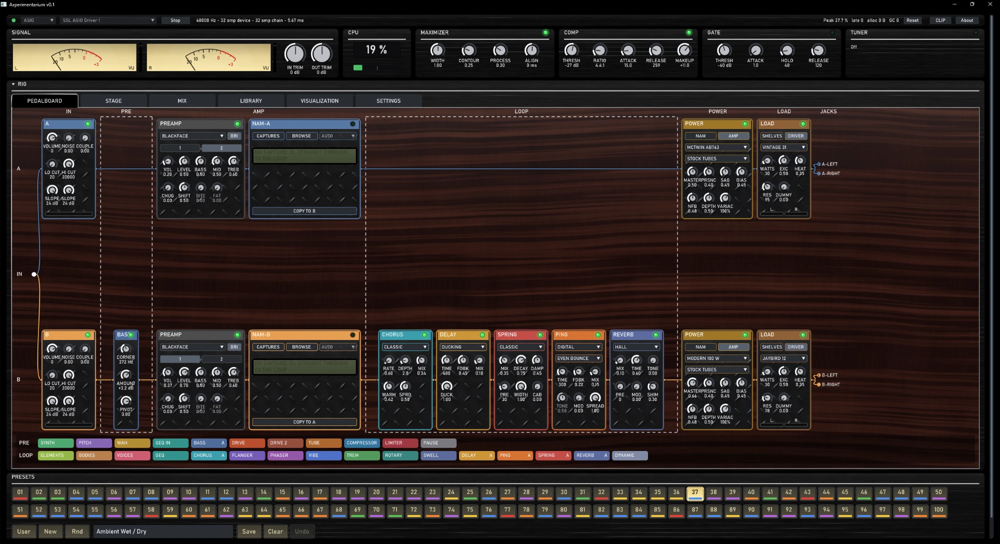
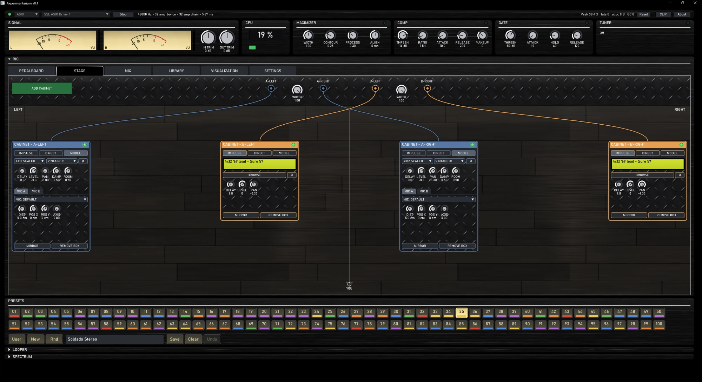
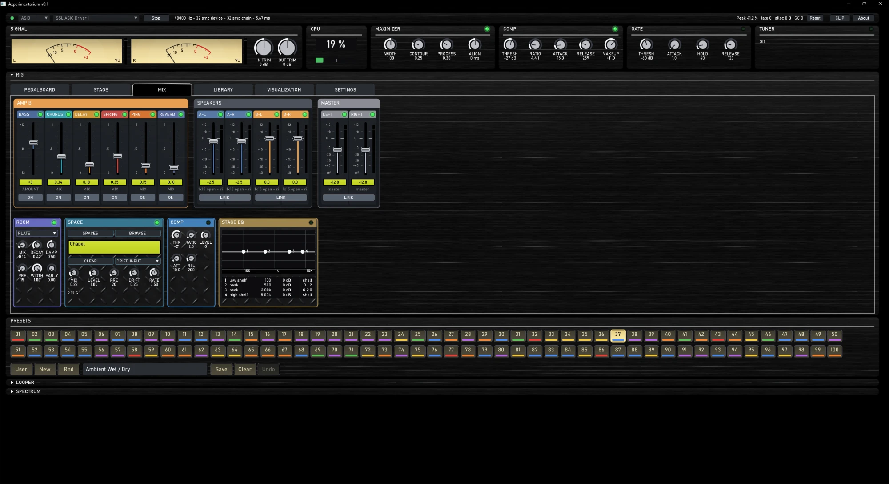
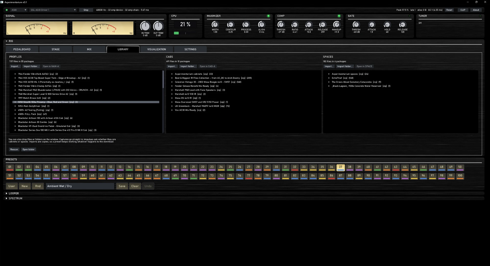

# Axperimentarium

A guitar rig for Windows. Amps, cabinets, pedals and rooms, played live through your audio interface.

**Plays your own Neural Amp Modeler captures (including A2), cabinet IRs and space (room) IRs**, next to its own
modelled amps, cabinets and 24 bundled rooms.

Free. By Peter Juul Noer.

**[Download v0.1 for Windows (64-bit)](https://github.com/pjngit/Axperimentarium/releases/latest)**

---

## Why I made this

I wanted a rig I could open in the evening and just play, without setting up a DAW. I also wanted to know why
a cranked amp sounds the way it does: what the power tubes do as they run out of headroom, what
moving the microphone a few centimetres does to a cabinet.

So the amps here are built from their circuits rather than from recordings. Turn the gain and the
preamp tubes clip the way the real ones do. Push the power section and the supply sags. Roll back the
guitar's volume into the fuzz and it cleans up, because the pickup is part of the circuit. The cabinets
are modelled too: pick a speaker, pick a microphone, then move it from the cap to the edge of the cone.

If you already have NAM captures and IRs, they play here as well, and you can put a modelled preamp in
front of a capture to push it somewhere new.

It is not trying to replace your favourite plugin. It is a place to experiment, hence the name.

## Your files

- **NAM captures** (`.nam`, including the A2 architecture) on the NAM-A and NAM-B slots.
- **Cabinet IRs** (`.wav`) in any cabinet box, as many boxes as you like, each with its own delay, level and pan.
- **Space IRs** (`.wav`) on the SPACE pedal, from a small room to a cathedral or a cave.

Drag files, folders or zips onto the window, or use **Import…** in the library. Imports are copies, so a preset keeps
working whatever happens to the download.

## What's in it

**Two amps, A and B**, in stereo or blended, each with its own chain:

- **PREAMP**, modelled: blackface, tweed, plexi, fox 30, mcrumble ods, mctable mark, mcultra 5051, mcdiesel vh4, each with its channels.
- **NAM** capture slot, before or instead of the preamp.
- **POWER**, modelled: bassdad 5F6-A, plexi 1987, fox 30, deluxe 5E3, mctwin AB763, mcultra 5051, modern 100 W.
  Tubes: stock, EL34, 6L6GC, 6V6, EL84, KT66. Sag, bias, negative feedback and a variac.
- **LOAD**: the speaker talking back to the power amp. Vintage 31, Greenbuck, Hefty 30, True Blue, Jansen 12, Jaybird 12.

**Cabinets** on the STAGE: an impulse, a direct box, or a modelled cabinet with a speaker and one or two placeable
microphones (Sure 57, Sure 7B, Big Brick 421, Flat Cap 906, Eye 5, Radio Dad 20, Ribbon Candy 160, Ribbon Roll 121,
Money Mic 87, Cardi-Oh 414). 33 cabinet IRs are bundled.

**Pedals before the amp**

- **DRIVE / DRIVE 2**, 28 types, most modelled from their circuits: Scream Bob, Super Dad-1, Blues Dad-2, Blues Brekkie, Klone Ranger, Micro Chump,
  Dadstortion-1, Dadstortion '78, Metal McMetalface, Rodent, Big Fluff, Fuzz McFace, Rangefinder, Tone Blender, Octavius,
  Tube Tuber, Plexiglass, Bottom Feeder, Velcro Fuzz, Bitcrusher, and eight lighter "curve" versions. Swappable clipping diodes.
- **SYNTH**: spectral, flute, organ, saw, odd, sine, brass, bell, bass.
- **PITCH**: shift, spectral, hybrid, fast, precise, octaves, harmony, synth bass.
- **WAH**: classic, low-pass, vocal, auto, step.
- **COMPRESSOR**, **LIMITER**, **TUBE**, **BASS** (moves the low end), **GEQ IN** (graphic EQ), **PAUSE** (a short delay for doubling).

**Pedals in the loop**

- **CHORUS**: classic, ensemble, dimension, vibrato, doubler.
- **FLANGER**: classic, through-zero, negative, barberpole, envelope.
- **PHASER**: classic, deep, bi-phase, envelope, stepped.
- **VIBE**: chorus, vibrato, throb, rotary, deep.
- **TREM**: classic, square, opto, harmonic, ramp.
- **ROTARY**: slow, fast, stop; classic, guitar rotor, horn only, close mics, driven.
- **SWELL**: classic, bow, reverse, fade, waves, poly.
- **DELAY**: digital, tape, analog, ducking, modulated, multi-tap, lo-fi, reverse, shimmer, dub.
- **PING** (ping-pong): digital, tape, analog, lo-fi; even, dotted, triplet, half and long bounces.
- **SPRING**: classic, short, long, surf, twin.
- **REVERB**: room, chamber, plate, hall, ensemble hall, cathedral, cloud, shimmer, gated, reverse, ambience, bloom, ducked, lo-fi.
- **ELEMENTS**: water, earth, air, wind, fire, wood, glass, spirit, metal, ice, smoke, lightning.
- **BODIES** (resonant bodies): sitar, koto, banjo, violin, cello, bottle, pipe, drum.
- **VOICES** (formants): ah, ee, oo, oh, nasal, growl, whisper, talk.
- **GEQ** and **DYNAMIC** (dynamic EQ).

**After the amps**

- **ROOM**: booth, studio, garage, small room, live room, big room, plate, hall, arena.
- **SPACE**: an IR room with pre-delay, slow drift and rate. 24 bundled rooms, from Studio and Club stage to Reservoir, Cavern and Cathedral.
- **COMP**, **STAGE EQ**, a mixer with speaker and master faders.
- **MAXIMIZER**, **COMP** and **GATE** in the signal strip, a **TUNER**, a **LOOPER** and a spectrum view.

**100 presets** to start from.

## Getting started

You need Windows 10 or 11 (64-bit) and an audio interface. ASIO gives the lowest latency; WASAPI works without a driver.

1. Download the zip from [Releases](https://github.com/pjngit/Axperimentarium/releases/latest) and unzip it anywhere.
2. Run `Axperimentarium.exe`.
3. Pick your interface and press **Start**.
4. Choose a preset and play.

**"Windows protected your PC"?** The program is not code-signed, so Windows does not recognise the publisher yet.
Click **More info**, then **Run anyway**.

**Set CALIBRATION once.** Under SETTINGS, press **Measure**, play your hardest chord, then **Apply**. This tells the rig how
hot your interface's input is, so the amps break up when they should.

**Crackles or dropouts?** Stop, raise the block size in SETTINGS (64 or 128) and start again. Leave **Threads** on Auto
unless your machine has few cores.

Everything you import, save or record lives in `%LOCALAPPDATA%\Drylane\GuitarRig`.

## Problems

If something breaks, the app says so in red and writes `fault.log` in the folder above, with buttons to copy the error or open the log.
Please [open an issue](https://github.com/pjngit/Axperimentarium/issues) and include it, plus your interface and block size.

## Thanks

Neural Amp Modeler by Steven Atkinson ([github.com/sdatkinson/neural-amp-modeler](https://github.com/sdatkinson/neural-amp-modeler)).
Most of the rooms are rebuilt from the [EchoThief](http://www.echothief.com) impulse library by Chris Warren.
Other libraries are listed in [THIRD-PARTY.txt](THIRD-PARTY.txt).

Axperimentarium is not affiliated with the makers of the amplifiers, pedals, speakers or microphones that inspired its models.
